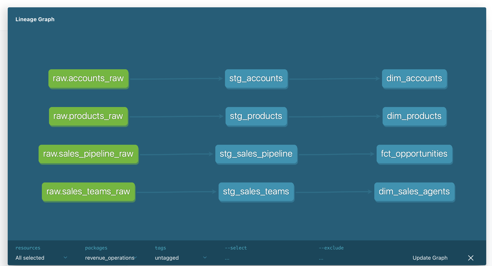
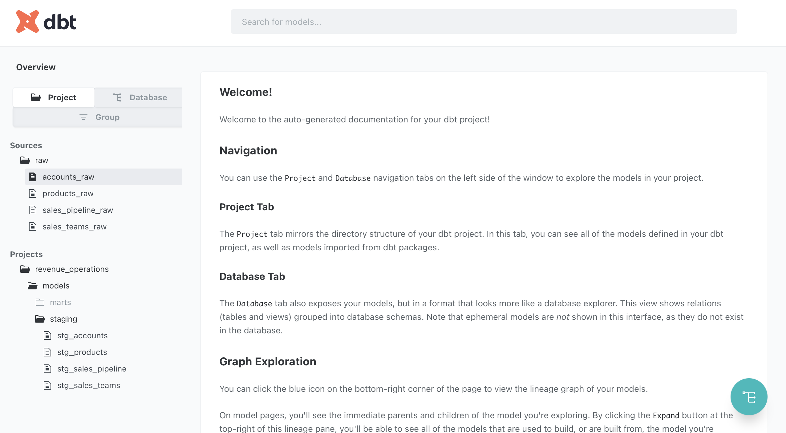
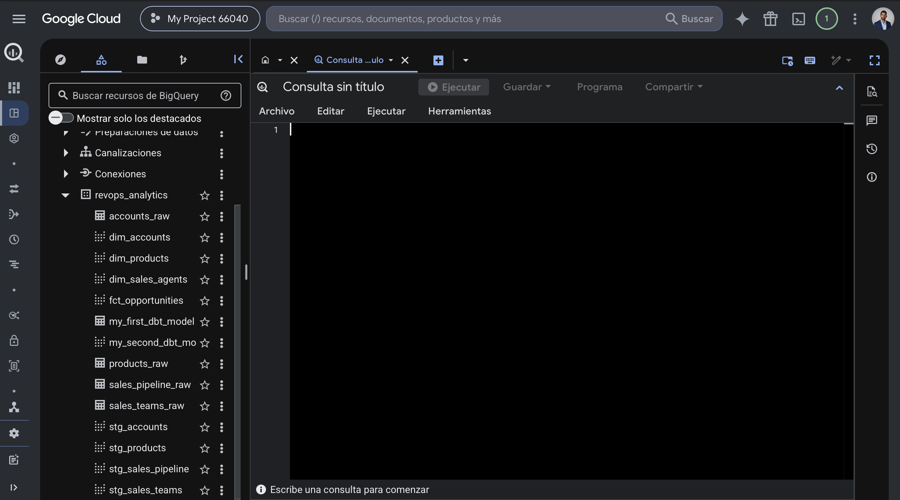

# Revenue Operations Analytics Pipeline

## Overview

This project simulates a modern Revenue Operations (RevOps) analytics workflow by building an end-to-end data pipeline using Python, SQL, BigQuery, dbt, and Power BI.

The objective is to transform raw CRM and sales data into analytics-ready datasets that support revenue reporting, sales performance analysis, pipeline monitoring, and business decision-making.

The project demonstrates a complete analytics workflow including:

- Data ingestion
- Data validation
- Data modeling
- Data quality testing
- Data warehousing
- Business intelligence reporting

---

## Business Problem

Revenue teams need reliable reporting to understand:

- How many opportunities are generated
- Revenue generated by products
- Revenue generated by sales representatives
- Pipeline conversion performance
- Win rates across sales stages
- Pipeline growth trends

Raw CRM exports are often inconsistent and difficult to analyze directly.

This project creates a structured analytics layer that enables accurate reporting and decision-making.

---

## Dataset

The project uses a synthetic Revenue Operations dataset containing:

### Accounts

Customer and company information.

### Products

Product catalog and pricing information.

### Sales Pipeline

Opportunity-level sales records.

### Sales Teams

Sales representatives and management structure.

---

## Tech Stack

| Layer | Technology |
|---------|------------|
| Data Processing | Python |
| Data Warehouse | BigQuery |
| Transformation | SQL |
| Data Modeling | dbt |
| Data Quality | dbt Tests |
| Documentation | dbt Docs |
| Visualization | Power BI |
| Version Control | Git & GitHub |

---

## Architecture

```text
Raw Data
    ↓
Python Data Audit
    ↓
BigQuery Raw Tables
    ↓
dbt Staging Models
    ↓
dbt Mart Models
    ↓
Fact & Dimension Tables
    ↓
Power BI Dashboard
```

---

## Data Pipeline

### Step 1 — Data Audit (Python)

A Python notebook was used to:

- Inspect datasets
- Identify missing values
- Validate schema consistency
- Review data quality issues

Notebook:

```text
notebook/01_data_audit.ipynb
```

### Step 2 — Load to BigQuery

Raw CSV files were loaded into BigQuery.

Tables created:

```text
accounts_raw
products_raw
sales_pipeline_raw
sales_teams_raw
```

### Step 3 — Build dbt Models

#### Staging Layer

Standardizes and cleans source data.

Models:

```text
stg_accounts
stg_products
stg_sales_pipeline
stg_sales_teams
```

#### Mart Layer

Business-ready analytical models.

Dimensions:

```text
dim_accounts
dim_products
dim_sales_agents
```

Fact Table:

```text
fct_opportunities
```

---

## Data Model

### Fact Table

#### fct_opportunities

Contains:

- Opportunity ID
- Account
- Product
- Sales Agent
- Deal Stage
- Close Date
- Close Value

Used as the central analytical table for reporting.

### Dimension Tables

#### dim_accounts

Account-level information.

#### dim_products

Product catalog information.

#### dim_sales_agents

Sales team hierarchy information.

---

## Data Quality Testing

dbt tests were implemented to validate data integrity.

### Not Null Tests

```text
opportunity_id
product
sales_agent
account
```

### Unique Tests

```text
opportunity_id
product
sales_agent
account
```

### Results

```text
PASS = 7
WARN = 0
ERROR = 0
```

---

## Data Lineage



The lineage graph documents how raw CRM datasets are transformed into staging models and analytical marts using dbt.

---

## dbt Documentation



dbt automatically generates project documentation, allowing stakeholders and analysts to understand model dependencies and metadata.

---

## BigQuery Warehouse



BigQuery serves as the centralized cloud data warehouse, storing raw, staging, and analytical datasets.

---

## Power BI Dashboard


The dashboard provides a business-friendly analytical layer for monitoring revenue performance and sales effectiveness.

### KPIs

- Total Opportunities: 8.8K
- Total Revenue: $10.0M
- Won Opportunities: 4.2K
- Win Rate: 63.2%

### Visualizations

- Revenue by Product
- Revenue by Sales Agent
- Opportunity Distribution by Stage
- Pipeline Creation Trend

---

## Key Findings

### Pipeline Performance

- 8,800 total opportunities
- 4,238 won opportunities
- 63.2% win rate

### Revenue Generation

- Total revenue exceeded $10M.
- Revenue is concentrated in successfully closed opportunities.

### Sales Performance

- A small group of sales representatives generated a significant share of total revenue.
- Top-performing sales agents consistently outperformed the rest of the team.

### Product Performance

- GTX Pro and GTX Plus Pro generated the highest revenue.
- Product performance varies significantly across the portfolio.

### Pipeline Trends

- Opportunity creation increased steadily during the first half of the year.
- Activity peaked around August before gradually declining.

---

## Project Structure

```text
revenue-operations-analytics
│
├── data
│   └── raw
│
├── notebook
│   └── 01_data_audit.ipynb
│
├── revenue_operations
│   ├── models
│   │   ├── staging
│   │   └── marts
│   │
│   ├── tests
│   ├── macros
│   └── snapshots
│
├── scripts
│   └── load_to_bigquery.py
│
├── docs
│   ├── dashboard.png
│   ├── dbt_lineage.png
│   ├── dbt_docs.png
│   └── bigquery_models.png
│
├── requirements.txt
└── README.md
```

---

## Skills Demonstrated

- Python
- SQL
- BigQuery
- dbt
- Data Modeling
- ETL
- Data Warehousing
- Data Quality Testing
- Power BI
- Business Intelligence
- Git
- GitHub

---

## Author

**Michael Romero**

LinkedIn:
https://www.linkedin.com/in/michael-romero-analytics

GitHub:
https://github.com/michaelromeroros
